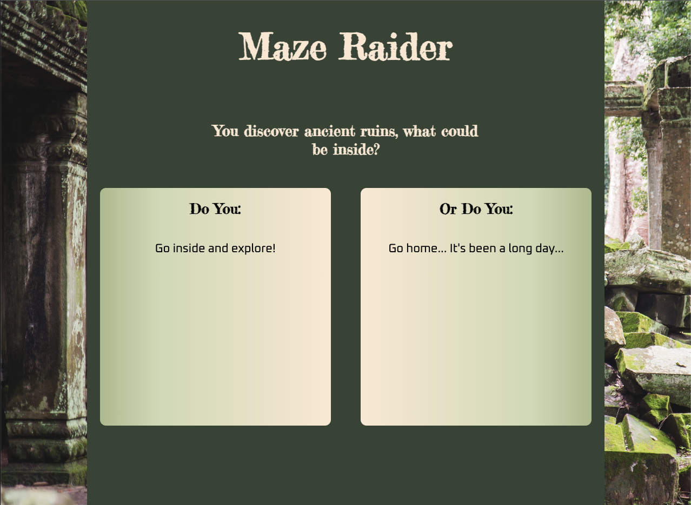

# Maze Raider

## Getting Started:
Play [here!](https://bryce-cazier-maze.netlify.app/)

Game will load in browser, no need to download anything!

### Maze Raider is a choose your own adventure styled game where you explore ancient ruins in search of treasure and adventure. At various points you may be faced with battling theives, wild animals, or risking your life on the edge of a cliff! At every step you will be given two choices, just click on whichever option sounds like the better adventure to you! Be warned though, as certain options will lead to paths where you need to click multiple times on a button in order to escape danger!

## Technologies Used:

## Future Enhancements:
I've left this game open to the possibility of expansion, with the addition of extra mini-games and challenges, a travel journal/map, and health bars as I progress along my own journey. Check back often to see what new adventure awaits!

## Ice Box:
- [ ] Add audio when selecting an option
- [ ] Style buttons, replace climb and row buttons with icons
- [ ] Add a hamburger menu that includes a light/dark mode toggle
- [ ] Add sepparate storylines for different portals and expand them
- [ ] Add an item bag and introduce the capability to pick up items along the journey
- [ ] Add a health bar
- [ ] Add a map that has the route the player has taken pushed to it

## Planning Materials:
My thoughts as I was planning this game can be found [here.](https://docs.google.com/document/d/1p7VmkYgwXGtXGA-RRMRZaGgOxLO5V7W77Y6wOlWPIkE/edit)

## Credits & Attributions:

Favicon was obtained from:

[Maze icons created by Good Ware - Flaticon](https://www.flaticon.com/free-icons/maze)

Light Mode Background:

Photo by [Raph Howald](https://unsplash.com/@raphhowald?utm_source=unsplash&utm_medium=referral&utm_content=creditCopyText) on [Unsplash](https://unsplash.com/photos/GSCtoEEqntQ?utm_source=unsplash&utm_medium=referral&utm_content=creditCopyText)

Background Music:

From [szegvari](https://freesound.org/people/szegvari/) on [freesound](https://freesound.org/people/szegvari/sounds/580374/)
  
Portal Music:

From [MATRIXXX_](https://freesound.org/people/MATRIXXX_/) on [freesound](https://freesound.org/people/MATRIXXX_/sounds/657541/)

Dead Sound:

From [gunnbladez](https://freesound.org/people/gunnbladez/) on [freesound](https://freesound.org/people/gunnbladez/sounds/662620/)

Technologies Used Buttons:

From [shields.io](https://shields.io/)